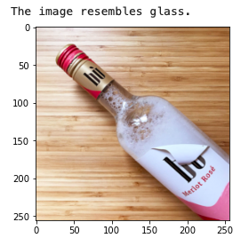
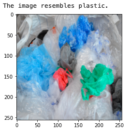
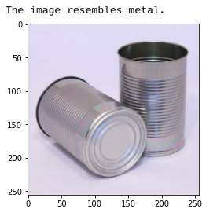

# Garbage Segregation
Our bot can identify and segregate waste in 6 different categories namely cardboard, glass, paper, metal, plastic and trash using Residual Networks in PyTorch. It uses transfer learning from a pre-trained Resnet- 50 model to generate a model which is capable of classifying images of individual waste objects into the mentioned categories.
Resnet- 50 model is pre-trained on ImageNet dataset images with a size of 256 x 256 and classified into 1000 classes.
The model is trained on garbage-classification dataset.

## Garbage Classification Dataset
This dataset is augmented for the training of the model. The original dataset contains 2527 RGB waste images of size 512*384 pixels. Each image is taken under these conditions: object being located at the center, with white background, common indoor lighting condition and no occlusion shadow. The images are labeled with 6 categories (paper, glass, trash, metal, plastic, cardboard). Figure shows sample waste images from the original dataset representing each class:

    

The original dataset is not evenly distributed. There are 594 images labelled Paper, 501 images labelled Glass, 482 images labelled Plastic, 410 images labelled Metal, 403 images labelled Cardboard and 137 images labelled trash. We have augmented images using torchvision.transforms, which helps in reducing the chances of overfitting or the inability to generalize on new data.
This kernel uses images of size 256x256 pixels after augmentation. For our purpose, we have used 1593 images for training, 176 images for validation and 758 images for testing.

The model is trained with images randomly selected from the training set. Multiple sets of hyper- parameters were traversed and the optimal setting was chosen, with the epoch number of 8. The model has achieved an validation accuracy of around 95%. Figures show the accuracy over epochs curves, and the training loss and validation loss over epochs curve.

    

    

Here are some images of the predictions of different types of waste:

    

    

    

